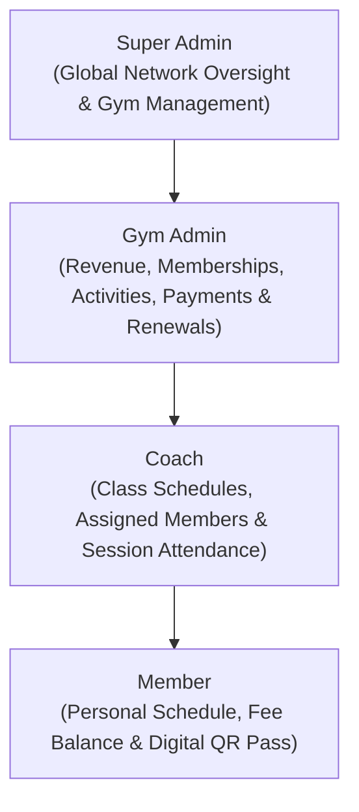

#  FitManager — Multi-Tenant Fitness & Gym Management SaaS

[](https://nestjs.com/)
[](https://react.dev/)
[](https://www.typescriptlang.org/)
[](https://www.mongodb.com/)
[](https://tailwindcss.com/)
[](http://localhost:3000/api/docs)

> A modern, full-stack gym management platform featuring **Role-Based Access Control (RBAC)**, **real-time session attendance tracking**, **digital member QR passes**, **automated subscription lifecycle management**, and **revenue analytics**.

---

##  Overview

Traditional gyms struggle with fragmented spreadsheets, manual paper sign-ins, and chaotic payment tracking. **FitManager** solves these operational pain points with a scalable, multi-tenant solution designed for gym networks, independent fitness clubs, coaches, and members.

###  4-Tier Role Architecture (RBAC)



* ** Super Admin:** Platform-level administrator managing gym clubs, assigning gym admins, and inspecting platform-wide analytics.
* ** Gym Admin:** Facility owner managing club activities, member directory, subscription creation/renewals, and financial revenue tracking.
* ** Coach:** Instructors scoped specifically to their assigned activities, member lists, and daily session attendance rosters.
* ** Member:** Adherents with a dedicated portal displaying their active memberships, payment status, class schedule, and digital QR gym pass.

---

##  Standout Features

### 1.  Session Attendance Tracking & Digital Member Pass
* **One-Click Coach Check-In:** Coaches open today's class roster to mark students as `Present` or `Absent` with a single click, or batch-mark the entire session with "Mark All Present".
* **Digital Member QR Pass:** Members carry a live digital pass on their dashboard with an SVG QR code encoding their member credentials and active status for seamless front-desk verification.

### 2.  Real-Time Capacity & Overbooking Protection
* Activities evaluate room hall capacity and activity ceilings dynamically.
* If a class is at capacity (e.g., `20/20`), the enrollment workflow automatically locks to guarantee safety and prevent overcrowding.

### 3.  Automated Expiry & One-Click Renewals
* **Background Cron Job:** Powered by `@nestjs/schedule`, an hourly task runs in the background to automatically identify memberships past their `endDate` and transition them to `expired`.
* **Instant Renewal:** Admins can renew expired memberships with a single click right from the dashboard attention list, advancing validity by 1 month.

### 4.  Direct Payment Processing
* Gym staff can record full subscription dues (Cash, Credit Card, Bank Transfer) with automated balance synchronization.

### 5.  Local Device Profile Photo Uploads
* Custom `PATCH /auth/me` endpoint using **Multer disk storage** to upload profile avatars directly from the user's computer/phone with file-type validation and size limits.

---

##  Tech Stack & Architecture

### Backend
* **Framework:** [NestJS](https://nestjs.com/) (Modular Architecture, Dependency Injection)
* **Database & ODM:** [MongoDB](https://www.mongodb.com/) with [Mongoose](https://mongoosejs.com/)
* **Authentication & Security:** Passport JWT, Bcrypt password hashing, Custom Role Guards (`RolesGuard`, `JwtAuthGuard`)
* **Automation:** `@nestjs/schedule` for hourly cron processing
* **File Handling:** Multer with static asset serving
* **Documentation:** Swagger OpenAPI (`@nestjs/swagger`)

### Frontend
* **Core:** React 19 + TypeScript + [Vite](https://vitejs.dev/)
* **State Management:** Redux Toolkit (`@reduxjs/toolkit`, `react-redux`)
* **Styling:** Tailwind CSS v4 + Framer Motion
* **Icons & Notifications:** Lucide React, Sonner Toasts
* **QR Codes:** `qrcode.react` (SVG rendering)

---

##  Project Structure

```
FitManager/
├── backend/
│   ├── src/
│   │   ├── activities/      # Activity schemas, service, controller
│   │   ├── attendance/      # Attendance tracking & session check-ins
│   │   ├── auth/            # JWT auth, login, register, profile updates
│   │   ├── gyms/            # Gym facility management & hall capacity
│   │   ├── members/         # Member CRUD & coach-scoped queries
│   │   ├── payments/        # Payment recording & dues calculation
│   │   ├── subscriptions/   # Subscriptions, cron expiry & renewals
│   │   └── users/           # Admin and coach account management
│   └── seed-admin-dashboard.js # Comprehensive database seeder
├── frontend/
│   ├── src/
│   │   ├── api/             # Axios instance & interceptors
│   │   ├── components/      # Reusable dashboard, modal & UI components
│   │   ├── hooks/           # Custom React hooks (navigation, admin data)
│   │   ├── pages/           # Auth, Dashboard, and Profile views
│   │   ├── store/           # Redux Toolkit slices and interfaces
│   │   └── types/           # TypeScript interfaces & models
└── docker-compose.yml       # MongoDB local container service
```

---

##  Quickstart & Local Setup

### 1. Prerequisites
* [Node.js](https://nodejs.org/) (v18+ recommended)
* [Docker](https://www.docker.com/) (or a local MongoDB instance running on port 27017)

### 2. Start the Database
```bash
docker-compose up -d
```

### 3. Backend Setup
```bash
cd backend
npm install
npm run build

# Seed sample gyms, activities, members, and schedules
node seed-admin-dashboard.js

# Start the NestJS backend
npm run start:dev
```
* Backend API runs on: `http://localhost:3000`
* Interactive Swagger API Docs: `http://localhost:3000/api/docs`

### 4. Frontend Setup
```bash
cd ../frontend
npm install
npm run dev
```
* Frontend Application runs on: `http://localhost:5173`

---

##  Demo Login Credentials

You can test each role using the pre-seeded credentials:

| Role | Email | Password | Access Highlights |
|---|---|---|---|
| **Super Admin** | `admin@fitmanager.com` | `superadmin123` | Multi-club oversight, global analytics |
| **Gym Admin** | `admin.casablanca@fitmanager.com` | `admin1234` | Revenue stats, member directory, renewals |
| **Coach** | `coach.casablanca@fitmanager.com` | `coach1234` | Schedule, attendance roster check-in |
| **Member** | `member.active.casablanca@fitmanager.com` | `member1234` | Active pass, digital QR pass, payments |

---

##  Verification & Quality

* **Backend Compilation:** Clean NestJS compilation passing strict TypeScript checks (`nest build`).
* **Frontend Compilation:** Production bundle optimized with Vite & React 19 (`tsc -b && vite build`).
* **API Documentation:** Fully documented with Swagger decorators across all controllers and DTOs.

---

##  License
This project is open-source and available under the [MIT License](LICENSE).
